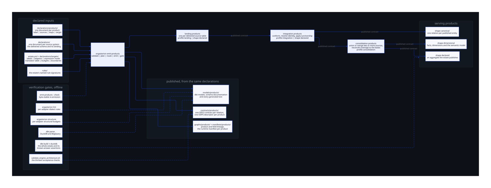
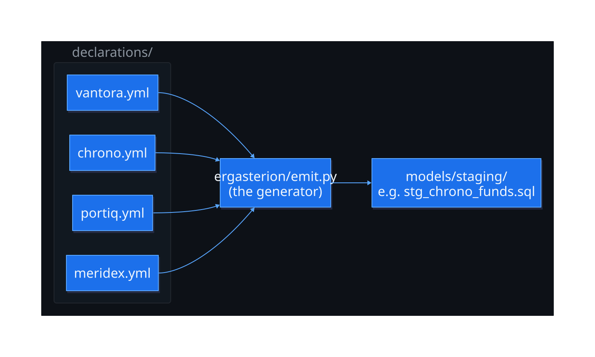
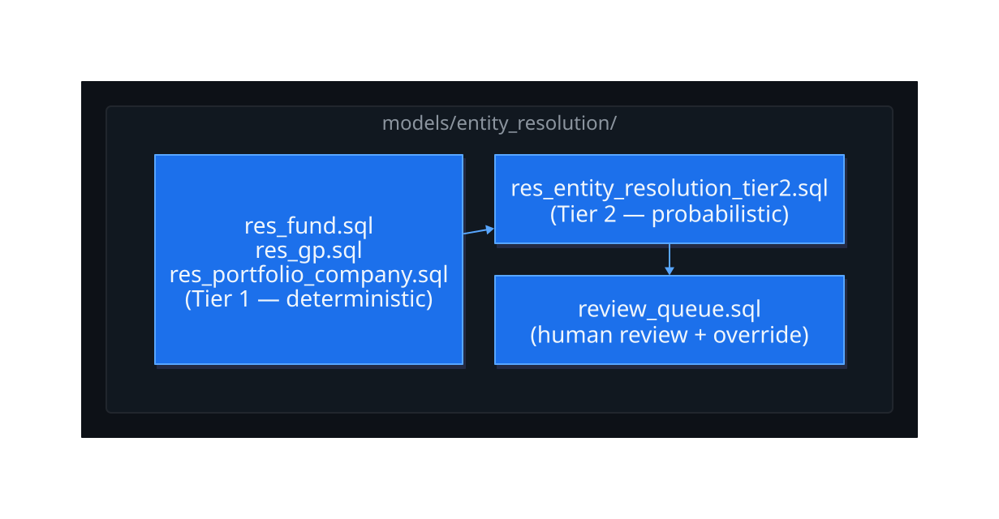
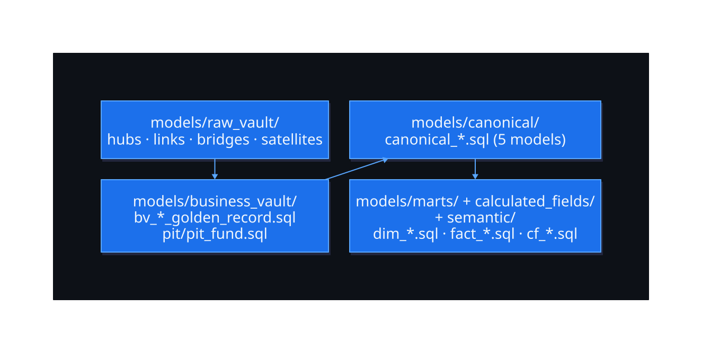
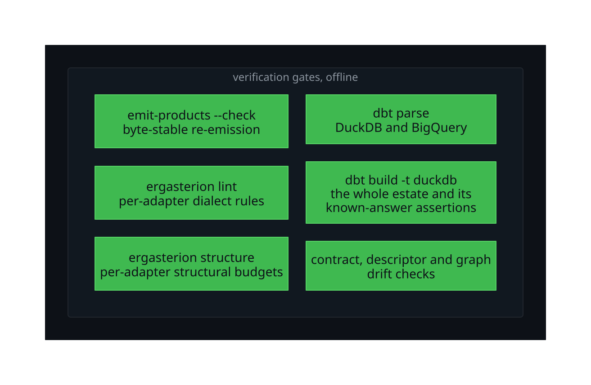

# Ergasterion architecture

Ergasterion is a factory that generates a whole data warehouse pipeline from a short, written description of each of your sources. The root [README.md](../../README.md) gets you installed and building your first pipeline. This document is the other half: the shape of the system once you are building against it, in one read, with no code required.

The factory core does not know or care what a customer, a fund, or any other real-world thing is. Everything below is generic. Wherever a concrete example helps, this document draws on whichever of the repository's two worked domains, an online retailer's customer view or an investment dataset, makes the point clearest. Neither one is the point of the factory; both are proof that the identical mechanism works on domains that share no vocabulary at all. The two domains, and OpenIM's narrow role in one of them, are covered in full toward the end of this document.

## The problem, before the factory

*Illustrative: a generic before-picture, not a diagram of this repository's own pipeline.*

Turning raw source feeds into a trustworthy warehouse normally means writing the same kind of plumbing by hand for every source: typed staging, history that never overwrites, clean served tables, tests. Written by hand, each source's script ends up shaped a little differently from the last, and the whole thing drifts out of date the moment a source changes and nobody remembers to update the script that reads it. The factory replaces the hand-written script with a generator: describe the source once, generate the plumbing, and rebuilding after a change is one command rather than a rewrite.

## The shape of the system, in one diagram

*The investment domain's four sources are drawn here for concreteness; the shape is identical for any domain, including the e-commerce example further down.*

Read left to right. A set of source declarations feed the engine (`ergasterion/emit.py`). The engine generates, in order, typed staging, then identity resolution, then the raw vault (history), then the business vault (golden records), then the canonical layer, then the served marts. A ring of gates checks the output at every stage rather than trusting it. Each stage gets its own closer look below.

## What you write, and what the engine writes

A working project is an **estate**: your own project, kept separate from the engine itself. Inside an estate, two kinds of file exist, and knowing which is which is the whole key to reading this system.

You write:

- **A domain** (`domains/<name>.yml`): the real-world things you care about, a customer, a fund, an order, and how they relate. If several sources ever describe the same thing, your rules for resolving duplicates and choosing a winning value live here too.
- **A source declaration** (`declarations/<source>.yml`), one per incoming feed: its columns, and which real-world thing in the domain each column belongs to.
- **The served layer itself**: the small set of final, clean tables and measure definitions a person actually queries, the `canonical_*` models and the `dim_*` / `fact_*` marts. The engine hands these its output; a person designs the served shape on top, on purpose, because that is the layer everyone downstream builds their trust on.

From those descriptions, the engine writes everything else: typed staging, identity resolution, the raw vault, the business vault's golden records, the data contracts, the product descriptor, and the graph map. None of that middle section is hand-maintained. Change a description and regenerate; the generated layers are always a direct, reproducible function of what you wrote, never an accumulation of manual edits, and the build refuses to run if anyone has hand-edited a generated file instead of the description it came from.

A small amount of authored intent goes in, a small amount of authored output comes out, and everything between the two is generated. That is the whole shape of the system. The rest of this document walks the generated middle, stage by stage.

## Following a source through the factory

**Declared. You write this.** A source declaration says what a feed sends, what its columns mean, and which real-world thing in the domain each column refers to. It is the only place any human judgment about meaning enters the system.

**Generated: typed staging.** The engine reads every declared source and generates one staging model per source: the same columns, typed, renamed to the domain's own vocabulary, nothing else changed.

**Resolved, when sources overlap.** One source per real-world entity is a normal, common estate, and needs none of what follows: the golden record the engine generates is simply that one source's value, passed through untouched. Identity resolution exists for the case where that does not hold, when two or more sources describe the same real-world thing under different spellings, different identifiers, or no shared identifier at all. It answers one question only, are these two records the same thing, and it is not a step every pipeline has to clear: a domain with a single source per entity never generates it. Where it does apply, the engine tries the strongest available signal first, a shared official identifier, then falls back to weaker signals such as a shared reference code or a normalised name match, recording the rule that made each match. Where no rule is confident enough, the pair is not merged automatically; it goes to a review queue for a person to decide, and that decision is remembered.

**Remembered: the raw vault.** Once identity is settled, directly for a single source or through resolution for several, every source's version of every fact is written to the raw vault (a warehouse pattern called a Data Vault) and dated. Nothing is overwritten. If two sources disagree, or a source corrects itself later, every version stays, so a later question, where did this number come from, can always be answered by walking back to what actually arrived.

**Chosen: golden records and survivorship.** The raw vault keeps every version; the business vault's golden record picks the one that counts. For each fact, a written rule, authored by the person responsible and changeable at any time, chooses which source wins: prefer the fund administrator for capital figures, prefer the CRM feed for a customer's contact details, and so on. The engine applies the rule; it never invents one, and the chosen record keeps a note of which source won and when, for every field.

**Served: the canonical layer and the marts. You write this too.** The winning values carry forward into the canonical layer and then into a small set of marts shaped for people and tools to query. As above, this served layer is the one piece of the generated-adjacent path a person still designs by hand, on top of what the engine produces.

**Published: the boundary.** Three more things come out of the same declarations, generated the same way as everything above, and published at the edge of the pipeline for other tools and other people to read:

- **A data contract per served table**, in the published Open Data Contract Standard (ODCS) format: schema, keys, the same quality checks the build already runs, and a note of which source wins each field.
- **One product descriptor per domain**, in the Open Data Product Standard (ODPS, Bitol): the tables' contracts wired together as output ports, plus the console and docs site a person operates the factory from.
- **A typed graph map of the domain**: the entities as nodes, the relationships between them as edges, in common graph query forms (openCypher, SQL/PGQ, GQL) that let a tool or an agent navigate the domain's shape without reading the warehouse.

None of the three is hand-written, and none of them can drift from the tables they describe: they regenerate from the same declarations everything else does, and the build fails if one is hand-edited instead.

## What keeps the generated layers honest

Four checks ring the whole generation rather than trusting it. The engine re-emits and checks that the output is byte-for-byte identical to the declarations. A linter checks the SQL for each supported dialect. dbt parses Snowflake, BigQuery, and DuckDB. A complete local DuckDB build executes the seeded estate and its business assertions. One validation command runs the set.

### Portable verification without a warehouse

**What it is.** A checkout with the project dependencies installed can verify the generated estate without connecting to a warehouse. The check answers whether the committed generated files still match their declarations and whether the factory's structural outputs remain internally consistent.

**How it works.** [`scripts/validate_offline.sh`](../../scripts/validate_offline.sh) locates the repository from its own path and selects Python and dbt from explicit environment variables or the command path. It first checks that the generated estate can be re-emitted without changing the committed files and runs the emitter and structure tests. It parses Snowflake, BigQuery, and DuckDB, then completes a full seeded DuckDB build before the downstream package, contract, graph, scaffold, and wheel gates.

**Worked example.** A successful run confirms that regeneration would not change the committed generated files. It parses all three supported targets and proves the worked data locally with DuckDB. It checks each ODCS contract and ODPS descriptor before comparing the graph artefacts with fresh output.

**How it is demonstrated.** The runnable check is [`scripts/validate_offline.sh`](../../scripts/validate_offline.sh).

**Boundaries.** The check does not load live credentials or connect to Snowflake or BigQuery. It does not validate data in either live warehouse. The command requires Git and Bash. A first run needs network access if dbt packages are not already installed.

## The engine and the estate

`ergasterion/` is the installed engine: the generators, validators, templates, schemas, and consumer scaffold. It reads whichever estate's `domains/*.yml` it is pointed at. Everything else, `domains/`, `declarations/`, `seeds/`, and the served layer inside `models/`, belongs to this worked estate. The file-by-file layout is in the root [README.md](../../README.md#for-engineers).

### Console scoring configuration by target

**What it is.** The console implementation derives a raw schema from the selected target and converts scoring seed rows into entity resolution weights and thresholds. If row loading or validation fails, the selector returns the static fallback and describes the failure through its status and detail values.

**How it works.** The tested helpers validate and quote the identifiers used to build the scoring table relation. The pure transformation checks the required metrics, entity uniqueness, numeric bounds, weight totals, and uniform thresholds. The selector distinguishes unavailable data from invalid data.

**Worked example.** Selecting `DEV` derives the `DEV_RAW` schema. Uniform rows produce one weight set. When weights differ by entity type and thresholds remain uniform, label generation orders the profiles by entity type.

**How it is demonstrated.** [`streamlit/test_scoring_config.py`](../../streamlit/test_scoring_config.py) executes the production transformation and identifier functions from [`streamlit_app.py`](../../streamlit/streamlit_app.py) without importing Streamlit or Snowflake. It covers Snowpark row shapes, casing, invalid values, weight rules, thresholds, and target identifiers.

**Boundaries.** The test stops at the pure functions and does not exercise the live table read. Streamlit rendering and Snowflake connectivity remain outside its evidence. The transformation supports weights by entity type only when thresholds remain uniform.

## Two domains, one factory, and where OpenIM fits

Both worked domains run through the same declaration generator. The online-retail domain (customer, product, order) and the investment domain (fund, management firm, portfolio company, deal) are peers. The full walkthrough of both domains is in the root [README.md](../../README.md#the-two-worked-domains).

The [Open Investment Model (OpenIM)](https://openinvestmentmodel.org) is not part of the factory and is never required to build or run either domain. It is an optional validation aid the investment domain alone can use: a declaration's attribute lineage can be checked against OpenIM's public reference model, when a local checkout of it is pointed at explicitly. With no checkout given, the check is skipped with a warning, never a failure. The e-commerce domain has no equivalent and needs none, because it answers to no external model at all.

## Property-graph projection

[`ontology-map-lane.md`](ontology-map-lane.md) explains how a domain declaration becomes the typed graph map and how to extend its relationship vocabulary.

## Where to go next

The root [README.md](../../README.md) installs the engine and builds a first pipeline. [DEMO.md](../../DEMO.md) walks the source-description format field by field. [RUNBOOK.md](../../RUNBOOK.md) covers the account-free local build and the authorised live Snowflake path.
