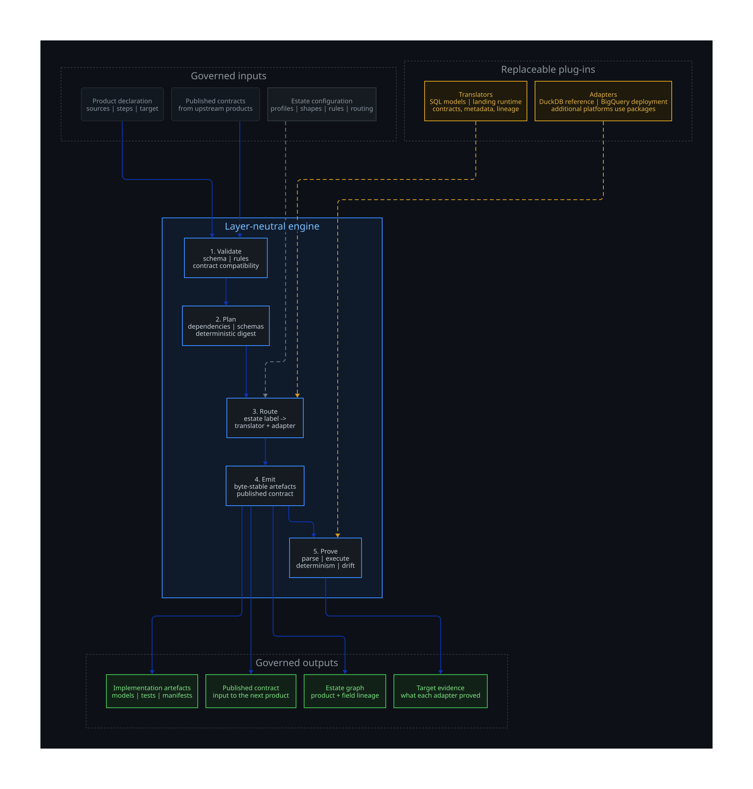
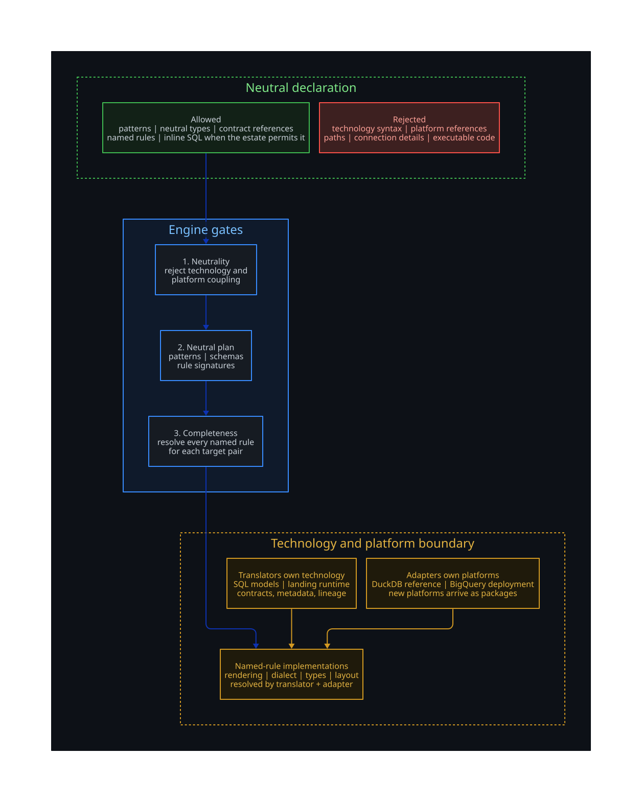
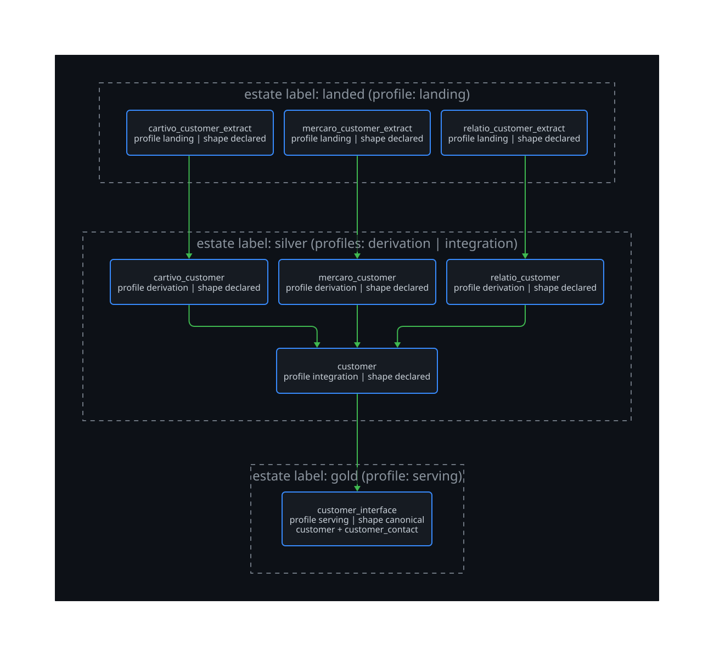

# Ergasterion engine architecture

**Status:** approved by the owner, 2026-09-03; amended the same evening with rulings R1 to R10 (section 15); amended again 2026-09-05 with the rulings the implementation produced (section 15, second amendment). This is the target architecture and it is now implemented. Departures return to the owner.
**Supersedes:** the layer narrative that used to sit in [README.md](README.md). The implementation has landed, and [the architecture guide](README.md) now describes it for a reader starting from zero. This document stays the design record: the target, its acceptance conditions, its open questions and the rulings that shaped it.
**Governing principle:** *layers are configuration*. The engine builds what a product declaration says and never carries a layer name in its logic. Bronze, Silver, Gold, base, feature and consolidated are configurations of one engine, applied by the estate on top.
**Canonical inputs:** the owner's fifteen-pattern catalogue and layered data-product framework. This document composes them into one engine. It does not restate them.

---

## 1. The engine in one paragraph

Ergasterion is one engine with one job. It reads a **product declaration**, which names the product's **layer label**, its **sources**, its **composition** of the closed fifteen-pattern set, and its **target**. It validates the declaration against the **profile** the label maps to (or the product names, where the label admits more than one) and the **shape** the target names. It resolves the declaration into an **execution plan** of pattern occurrences joined by edges that carry schemas. It routes every occurrence to the one **translator** the estate's translator table names for that label and pattern, which must have declared it can render that pattern for the estate's **adapters**. It emits artefacts deterministically, then runs its gates. Every product publishes a **contract**, and a contract is the only way one product feeds another. An estate is a **graph** of such products. Everything else, including what a layer is called, is estate configuration.



## 2. Vocabulary

| Term | Meaning |
|---|---|
| Estate | One governed set of products, profiles, shapes, adapters and bindings, owned by one organisation. |
| Product | The unit the engine builds. A declaration with sources, composition and target. Emits artefacts and one contract. |
| Source | A published contract this product consumes: a landing product contract or any other product's contract. Never a table name. |
| Pattern | One of the fifteen building blocks in the owner's catalogue. The engine has no other processing vocabulary. |
| Occurrence | One use of a pattern inside a product, with that pattern's configuration. A product may use a pattern more than once, for example validation before and after transformation. |
| Composition | The ordered occurrences of a product. |
| Profile | A declared composition constraint: which patterns are mandatory, optional and forbidden, and in what order. Estates name profiles; the engine enforces them. |
| Shape | The modelling form the target takes: declared, ODS, dimensional, canonical, Data Vault. A registered rendering with its own declaration schema. One per product. |
| Target | The product's published result: its shape, its relations, its contract, its materialisation intent. |
| Contract | The versioned interface a product publishes: identity, schema, quality, freshness, lineage, versioning, access, support. Generated from the declaration, never hand-written. |
| Edge | A dependency between two products through a contract, or between two occurrences inside a product through a handoff schema. |
| Graph | The acyclic set of products and their contract edges in an estate. |
| Generation | A product's depth in the graph. First, later and consolidating generations are depth, not types. |
| Translator | The execution technology axis. A component that renders pattern occurrences and shapes into artefacts for one technology: a dbt project, a distributed-processing job, another ETL tool's definitions, plain SQL. Owns occurrences, never layers. |
| Adapter | The platform axis. Where artefacts run: DuckDB and BigQuery are the two this estate declares, and any other platform is another adapter package. Owns dialect, physical types, identifiers, layout and structural limits. One adapter is the reference adapter that executes the whole estate locally. |
| Named rule | A business rule referenced from a declaration by name with a neutral signature, and implemented in code per translator and, where dialects differ, per adapter. The place where specifics are allowed. |
| Expression mode | Estate policy for inline SQL: `sql` (the default; declarations carry SQL and the engine parses it) or `named_only` (every rule is a named rule). |
| Runtime binding | Physical coordinates and environment for a deployment: project, database, dataset, schema, credentials reference. Outside every product declaration. |
| Layer label | A name an estate gives to a group of profiles, for example Bronze, Silver, Gold. A product declares the label it sits in. The estate maps each label to its profiles, its admissible shapes and its translators. The engine uses the label only as a key into that estate configuration, never as meaning. |
| Translator table | Estate configuration naming, for each layer label, the translator that renders each pattern and each shape. Declared once per estate, never in a product declaration. |

## 3. The product declaration

A product declaration is engine-neutral. It states what the product is, what it consumes, what it does, and what it publishes. It contains no engine syntax: no dbt or Jinja, no platform references, no file paths, no connection details. Its business logic is SQL (section 3.2), one text for every adapter. The neutrality gate enforces the no-engine-syntax rule; the parser, the per-adapter parse and dialect gates and the reference-adapter run prove the SQL.

### 3.1 Logical structure

```yaml
product:
  name: customer
  domain: ecommerce
  version: "2.1"
  layer: silver                     # the estate's label; the estate maps it to profiles, admissible shapes and translators
  profile: integration              # required only when the label admits more than one profile
  owner: customer-domain

sources:
  - contract: landing.crm_customer@1       # a published contract, pinned by major version
    expect:                                # what this product relies on; validated at emit
      fields: [customer_id, email, status_code, end_date]
  - contract: landing.storefront_customer@3

steps:                                     # the composition: ordered pattern occurrences
  - pattern: batch_transfer
  - pattern: data_validation
    stage: pre
    rules:
      - {field: customer_id, completeness: 1.0}
    on_failure: quarantine
    error_threshold: 0.001
  - pattern: schema_transform
    mapping:
      - {from: cust_nm, to: customer_name, type: string}
      - {from: crtd_dt, to: created_on, type: date}
  - pattern: calculated_fields
    fields:
      - {name: is_active, type: boolean, expression: "status_code IN ('A', 'P') AND end_date IS NULL"}
      - {name: risk_band, type: string, rule: risk_band_v2}      # a named rule, implemented per translator and adapter
  - pattern: data_enrichment
    lookups:
      - {contract: integration.customer_segment@1, on: {segment_code: segment_code}, fields: [segment_name], no_match: null}
  - pattern: data_curation
    entity: customer
    resolution: {strategy: deterministic, keys: [loyalty_id, normalised_email]}
    survivorship: {email: first_non_null, order_total: most_recent}
  - pattern: data_validation
    stage: post
    rules:
      - {field: customer_id, unique: true}
  - pattern: data_contracts
  - pattern: lineage_capture
  - pattern: metadata_capture
  - pattern: schema_publish
  - pattern: data_publish

target:
  shape: data_vault                        # declared | ods | dimensional | canonical | data_vault
  shape_config: { ... }                    # the shape's own declaration schema
  contract:
    freshness: "daily by 06:00 UTC"
    access: {classification: confidential}

checkpointing: {granularity: step, max_retries: 3, backoff: exponential}
```

The steps block is the composition. Each entry is one occurrence, and its keys are that pattern's configuration schema and nothing else. The engine owns one configuration schema per pattern. A shape may add a section to the target block, and only there.

Three further keys cover products with several sources or a producer with several published relations.

`combine` sits beside `sources` because it describes the source set. It names either a `union` under one conformed schema or a `merge` on declared keys. A merge also declares `join` as `inner` or `outer`.

Each source in a combination carries `conform`, a mapping of source fields, target fields, and types. Two sources that bring the same non-key field are refused. A rename in `conform` records which field the estate means.

A source carries `relation` when its producer publishes several relations. The value uses the relation name from the producer's shape. The contract reference already names the product, so the relation value has no product prefix.

A producer with one relation needs no `relation` key. A missing or unknown relation on a multi-relation producer fails closed. The same key applies to a `data_enrichment` lookup.

### 3.2 Business rules: two equal routes, both neutral in the declaration

A declaration states a business rule in one of two ways. Both keep the declaration free of technology and platform specifics. Neither is the escape hatch for the other.

**Named rules.** The declaration references a rule by name. The rule has one neutral signature, declared once in the estate's rule catalogue: its name, its input types, its output type, its version. Its implementations are code, held in translator and adapter packages, never in a declaration. This is the route for anything an estate wants reviewed and versioned as code, and for anything that needs a platform idiom. It is always available.

**Inline SQL.** SQL is the inline language of a declaration (owner ruling R3, 2026-09-03). A calculated field, filter, aggregate or whole select body can be written as SQL. There is no closed subset or fixed function list. The engine parses each expression with sqlglot behind a parser port. A parse error names the product, occurrence and position. Column references resolve against the visible schema, and an unresolved column fails closed. Resolved columns feed field-level lineage. The text is rendered verbatim into generated artefacts. One text runs on every declared adapter; the engine never transpiles. A named rule with adapter dispatch handles genuine dialect differences.

The estate policy has two modes:

| Mode | What a declaration may carry | Who proves it |
|---|---|---|
| `sql` (the default) | Inline SQL as above, together with named rules. | The engine: parse, column resolution and lineage before emit; the per-adapter parse and dialect gates and the reference-adapter run after emit. |
| `named_only` | No inline SQL. Every rule is a named rule. | The engine, through the completeness gate. |

The mode is estate policy, never a per-product or per-column choice. Inline SQL still never carries technology syntax, platform references, file paths or executable code; the neutrality gate rejects those in both modes.

A product may use named rules and inline SQL together. The engine validates types and references against the neutral signature or the visible schema before any translator runs, so the plan is complete without knowing how any rule is implemented.

**Catalogue precedence.** A named rule's signature is declared in a rule catalogue, and there are two catalogue sources, merged with no shadowing. The engine's reference catalogue, shipped as package data, loads as the estate's defaults. An optional estate catalogue at the estate root may *add* rules the reference catalogue does not carry. A rule name declared more than once, within either source or across both, fails closed naming the rule and both declarations. An estate extends the reference catalogue; it never redefines a piece of it, so no estate can change what a reference rule means for a product that was written against it. The completeness gate then resolves every rule a validated product actually references against every declared (translator, adapter) pair, and fails closed naming the rule and the pair.

### 3.3 The neutral type system

Declarations use logical types: string, integer, decimal with precision and scale, boolean, date, timestamp, and the structured types the estate enables. Each adapter owns the mapping to its physical types. Type mapping never appears in a declaration.

### 3.4 The split: any technology, any platform, no specifics in declarations

The engine has to produce any kind of target and at the same time forbid specifics in declarations. Those are two different guarantees, and they are met by two different mechanisms.

**Any target** comes from two independent axes, both plug-ins:

| Axis | Examples | Owns |
|---|---|---|
| Translator, the technology | dbt, a distributed-processing job runner, another ETL tool, plain SQL scripts | How an occurrence and a shape are rendered for that technology; generated tests; the technology's deployment artefacts |
| Adapter, the platform | DuckDB and BigQuery in this estate; another platform is another adapter package | Dialect, physical type mapping, identifier rules, physical layout, structural budgets, live evidence lane |

A capability is a tuple: (pattern or shape, translator, adapter). Routing matches occurrences to capabilities. Adding a technology is a translator. Adding a platform is an adapter. Neither touches the engine or any declaration.

**No specifics** comes from where specifics are allowed to live and a gate that enforces it:

- A declaration holds only pattern configuration, neutral types, inline SQL where the estate policy allows it, contract references and named-rule references.
- Specifics live only inside translator packages, adapter packages and named-rule implementations. A named rule is implemented per translator, and inside a translator per adapter where dialects differ; a translator may declare one implementation neutral across all its adapters.
- A neutrality gate rejects any declaration carrying technology syntax (dbt or Jinja, `ref`, `source`), platform references, file paths or executable code, in both modes. It does not police which SQL constructs an expression uses; the parser and the per-adapter gates do.
- A completeness gate resolves every referenced rule against every declared (translator, adapter) pair and fails closed on a gap, naming the rule and the pair.



So the answer to "does per-adapter implementation give the split" is: only with the translator axis beside it. Platform alone would let a warehouse macro satisfy a rule that a job-based translator cannot render. The two-axis capability model and the two gates are what keep declarations portable while letting an estate target anything.

### 3.5 Identifiers: one logical name, one declared stored name

A declaration carries plain lower-case logical identifiers and nothing else. The engine never folds, quotes or rewrites a declared name, and never infers one name from another.

Where an interface outside the estate requires an exact name the estate does not own, the declaration states that name beside the logical one. A product may state the table its published relation is stored as, the schema it is stored in, and the stored name of any of its columns; a shape publishing several relations addresses each by the name the shape gives it. A landing declaration states the same for a delivered table and each delivered column, in the product declaration and in the portable landing IDL. Every one of those is optional and absent by default.

The rest follows without a second declaration anywhere:

- a consumer references producer columns by logical name only, and the renderer resolves the producer's stored name through the producer's contract;
- the published relation's final projection renames each logical column to its stored name, and the relation takes the declared table name and schema;
- quoting is the adapter's, not the engine's. Generated SQL stays one text for every declared platform and carries no quote character; a stored name reaches it through a dispatch macro that calls the running adapter's own quoting, and the per-adapter parse gate resolves that call from the adapter's declared identifier rules;
- the contract, the runtime manifest and the product graph carry both names wherever they differ, so a downstream check compares the estate's output against the required schema with no rename step.

Five named rules hold it closed, each naming the product, the relation, the column and the adapter: a missing or blank stored name; a stored name that is not portable on an adapter (its quote character, a dot, a line break, or more characters than the estate budgets for that adapter); two columns of one relation reaching one stored name after the adapter's declared comparison rule; two published relations reaching one stored schema and table after the same rule; and a schema override an adapter cannot address.

## 4. The fifteen patterns as the engine's only vocabulary

The catalogue is closed. Adding a processing capability means adding a pattern to the catalogue through the owner, not adding a special case to the engine. Each pattern is a contract the engine holds once:

| Pattern | Its configuration holds | It emits | Semantics the translator must honour |
|---|---|---|---|
| Batch Ingestion | Source connection reference, scope, cadence, extract mode | Landing relations, receipt records | Controlled, repeatable, tracked extract versus arrival |
| Batch Transfer | Upstream contract reference | A read of a published product | No transformation during transfer; lineage carried forward |
| Schema Transform | Field mapping: rename, cast, flatten, drop, null handling | Structural mapping relation | Structural only; no logic |
| Calculated Fields | Named fields with SQL expressions or named rules, rule version | Derived columns | Idempotent; no lookups; version captured |
| Data Enrichment | Lookups against reference product contracts, join keys, no-match policy | Enriched relation | Reference is a governed product; temporal join where declared |
| Data Filtering | Named predicates, each a SQL predicate | Filtered relation and a filter log | Every exclusion auditable by predicate and count |
| Data Validation | Rules by type, stage, threshold, on-failure policy | Tests, quarantine relation, abort condition | Quarantine, threshold, abort; never silent pass-through |
| Data Aggregation | Grain, groups, aggregate expressions, late-arrival policy | Aggregate relation | Versioned, deterministic recomputation |
| Data Curation | Entity, resolution strategy, keys, survivorship, merge rules | Golden record, resolution evidence | Explicit precedence; unresolved stays visible |
| Data Contracts | Nothing beyond the target contract block | ODCS contract per published table and its compliance check | Product not published if it violates its contract |
| Lineage Capture | Nothing; derived from the declaration | Product and field lineage in the estate graph; run-level lineage at execution | Captured at build, never inferred later |
| Metadata Capture | Descriptions, ownership, classification | ODPS product descriptor and catalogue metadata from declaration and contract | Declaration is the documentation |
| Schema Publish | Versioning policy | ODCS version registration and change classification | Additive is minor; breaking is major |
| Data Publish | Publication mode | Atomic publication, current pointer, SLA record | All or nothing |
| Checkpoint & Retries | Granularity, retries, backoff | Wrapper around the composition | Every step idempotent |

Some semantics are runtime behaviour, for example quarantine and atomic publication. The translator that owns the occurrence emits what the adapter needs to honour them, and the runtime records the evidence. The engine never weakens a pattern's semantics to fit an adapter.

## 5. Profiles: composition as configuration

A profile declares which patterns are mandatory, optional and forbidden for a product, the ordering constraints between them, and the stages a repeated pattern may take. The engine ships reference profiles derived from the owner's catalogue compositions and enforces whichever profile a product names. An estate may declare its own profiles and rename the reference ones. A product naming an unknown profile fails closed.

Reference profile names describe what the composition does. They carry no organisation's layer or product vocabulary.

| Reference profile | Composition it constrains | Mandatory | Optional | Forbidden |
|---|---|---|---|---|
| landing | Bring external data in unchanged | Batch Ingestion, Data Validation, Data Contracts, Lineage Capture, Metadata Capture, Schema Publish, Data Publish, Checkpoint & Retries | Batch Transfer, Data Filtering for declared exclusions only | Schema Transform, Calculated Fields, Data Enrichment, Data Aggregation, Data Curation |
| integration | Conform and curate entities from landed products | Batch Transfer, Data Validation, Schema Transform, Data Curation, Data Contracts, Lineage Capture, Metadata Capture, Schema Publish, Data Publish, Checkpoint & Retries | Calculated Fields, Data Enrichment, Data Filtering, Data Aggregation | Batch Ingestion |
| derivation | Compute on top of integrated products | Batch Transfer, Data Validation, Calculated Fields, Data Contracts, Lineage Capture, Metadata Capture, Schema Publish, Data Publish, Checkpoint & Retries | Data Enrichment, Data Aggregation, Data Filtering | Batch Ingestion, Data Curation |
| consolidation | Combine two or more products into one | Batch Transfer from two or more product contracts, Data Validation, Data Contracts, Lineage Capture, Metadata Capture, Schema Publish, Data Publish, Checkpoint & Retries | Calculated Fields, Data Enrichment, Data Aggregation, Data Curation for cross-product merge | Batch Ingestion |
| serving | Deliver for a named consumer | Batch Transfer, Data Validation, Data Contracts, Lineage Capture, Metadata Capture, Data Publish, Checkpoint & Retries | Calculated Fields, Data Filtering, Data Aggregation, Data Curation, Schema Publish | Batch Ingestion |

One deliberate strengthening of the catalogue is that every product publishes a contract, because the contract is the only pipe. Data Contracts is mandatory in every profile, including landing, where it produces the Landing Product Contract.

Layer labels are an estate mapping over profiles. One estate may map Bronze to landing, Silver to integration, derivation and consolidation, and Gold to serving. Another may use its own product vocabulary, for example base, feature and consolidated products, and map each to a profile. A product declares the label it sits in and, when that label admits more than one profile, the profile (owner ruling R1). The engine reads the label only to look up the estate's mapping: its profiles, its admissible shapes and its translator table (section 11). It never branches on what the label means, and no layer word appears in engine code.

## 6. Shapes: the target as a plug-in

A shape is a registered rendering of a product's target. It carries its own declaration schema for the target block, any composition constraints it adds, and a rendering per translator. One shape per product. A second shape is a second product downstream. A shape is never a layer.

| Shape | Renders | Needs in the target block | Adds to composition |
|---|---|---|---|
| declared | The relations exactly as the composition produces them, no imposed modelling. The default. | Nothing, or an optional `select` carrying one whole SQL select body (section 3.2's inline route, in the one place a shape may add a section). Its output columns must be exactly the relation schema the composition publishes, or emission fails closed. | Nothing |
| ods | Normalised relational form: keys, effectivity, cross-reference, audit tail | Entities and keys | Nothing |
| dimensional | Facts and dimensions, declared grain, slowly changing dimension types, conformed dimensions, and the semantic layer: measures and metrics rendered as the translator's semantic model (MetricFlow YAML in the dbt translator), a publication artefact | Grain, dimensions, measures, metrics | Nothing |
| canonical | One relation per canonical entity over a curated product, typically a view at an interface boundary | Entity list | Requires an upstream curated product |
| data_vault | An identity store per entity, an association store per relationship, two insert-only version stores per payload, a surviving record per declared attribute, and a point-in-time relation over them | Its stores and its surviving-record rules | Requires a Data Curation occurrence |

Registering a shape is a plug-in act under the shape package directory, never an engine change. A product naming a shape no plug-in registers fails closed; there is no default shape and no fuzzy match.

A shape's contract publishes every relation the shape renders (owner ruling R4), and a consumer declares which of them it reads with the `relation` key of section 3.1. One answer serves everything: the contract, the estate graph and the translator all read the shape's own `relations()`, so a relation can never be published under a name one of them derived privately.

The `data_vault` shape carries state that a later run has to respect. A satellite's hashdiff basis is the exact column set used to compute its stored fingerprints. That basis is frozen once versions are stored under it. Moving it is a declared three-step operation: stage the pending basis, promote it, then regenerate and build. Every stored row keeps its basis version, so old fingerprints retain their original meaning. The shape records this state in a ledger that the emission route reads and updates with the other generated files.

The root estate exercises the `declared`, `canonical`, `dimensional` and `data_vault` shapes. The `ods` shape is exercised by a fixture estate. Data Vault also has a smaller fixture that isolates its generation and DuckDB build. Section 12 records that limit.

## 7. Contracts: the only pipe

Every product publishes one contract, generated from its declaration and shape. Its elements are those of the owner's framework: identity, schema, freshness, quality guarantees, versioning policy, lineage, access, support. The serialisations are retained from today: an Open Data Contract Standard (ODCS) document per published table and an Open Data Product Standard (ODPS) descriptor per product grouping its tables. Both are emitted from the declaration and shape by the translator the estate's table names for those patterns, the publication translator in the reference set (section 10). ODCS is the artefact of the Data Contracts pattern and the version registered by Schema Publish. ODPS is the artefact of Metadata Capture at product level. Neither is ever hand-written. The contract lists every relation the product's shape renders; a consumer declares which of them it reads.

A consumer names the contract and major version it consumes and declares what it expects from it. At emit the engine checks the expectation against the producer's current published contract and fails closed on any incompatibility. Schema evolution follows the catalogue rules: additive nullable fields are minor and non-breaking, removals, renames, type changes and new required fields are major and breaking. A consumer pinned to a major version is unaffected by minor changes and blocked by major ones until it re-declares.

The Landing Product Contract is the landing-profile contract. The mechanism is the same at every generation: landing publishes, the next generation consumes and publishes, and the chain continues to serving products.

## 8. The product graph and generations

Nodes are products. Edges are contract dependencies. The graph is acyclic. The engine orders it topologically and emits in that order.



Generation is depth, defined structurally:

- **First generation**: every source edge comes from a landing product.
- **Later generation**: at least one source edge comes from a non-landing product.
- **Consolidating**: two or more non-landing product sources, with a union or merge composition, a declared join where it is a merge, and declared schema conformance across them.
- **Combinations**: any acyclic arrangement of the above.

Controls between generations are declared, never inferred. A consolidated product proves its coverage with a Data Validation occurrence whose rules reference its upstream contracts, for example row-count reconciliation to its bases. The engine fails closed on cycles, on a source contract that does not exist, and on a source contract whose current version is incompatible with the consumer's expectation.

The graph itself is an emitted artefact. Product-level and field-level lineage come from the declarations at build. Run-level lineage comes from the runtime at execution.

## 9. Resolution, routing and emission

```text
declaration
  -> validate       schema per pattern, composition versus profile, shape constraints,
                    inline expression parse and column resolution, expression-mode policy,
                    reference resolution, contract compatibility, duplication
  -> plan           occurrences, edges with handoff schemas, checkpoint wrapper
  -> route          each occurrence to exactly one translator declaring (pattern or shape, translator, adapter)
  -> emit           artefacts per translator, deterministic, generated-marker on every file
  -> gate           dialect per adapter, structural budgets per adapter, determinism, drift
  -> evidence       what was proved, per adapter
```

**Validation** is deterministic and runs before emission. It checks the profile, pattern order, shape fields, expression policy and visible columns. It also checks rule implementations, declaration neutrality, source contracts and duplicate published names. Every failure names the declaration and rule that stopped it.

**The plan** is the resolved product: occurrences with their configuration, edges carrying the schema handed from one occurrence to the next, and the checkpoint wrapper enclosing the composition. A plan carries a digest. A translator built against a different plan digest is rejected.

**Routing** is declared and deterministic (owner ruling R1). The estate's translator table names the translator for each layer label, pattern and shape. The router looks up every occurrence and requires a registered capability for every declared adapter. A missing table entry or capability fails with the label, pattern and adapter. Several translators can serve one product. For a landing label, the runtime may own ingestion, validation, publication and retries. The publication translator can own contracts, schemas, metadata and lineage. Translators own occurrences. The router alone reads the label as a key.

**Emission** is byte-deterministic. The same declarations produce the same artefacts. Every generated file carries a marker. Check mode regenerates and reports drift against what is on disk without writing. Emission prints one summary line per product: layer label, profile, shape, adapters and artefact count (owner ruling R6).

**Gates** run per declared adapter: dialect rules, structural budgets, deterministic re-emission, and drift detection. A gate failure names the artefact, the rule and the adapter.

## 10. Translators and adapters

A translator renders occurrences into artefacts for one or more adapters. The reference set is:

- a SQL-model translator that renders the transformation patterns, the shapes, generated tests and contract compliance checks into a dbt project, target-neutral, with dialect divergence confined to declared dispatch;
- an ingestion-runtime translator that renders Batch Ingestion, Data Validation at landing, Checkpoint & Retries and Data Publish for landing products against the runtime's ports;
- a publication translator that renders Data Contracts, Lineage Capture, Metadata Capture and Schema Publish into ODCS contracts, ODPS product descriptors, catalogue metadata and the estate graph.

Another technology, for example a distributed-processing job translator, another ETL tool's definition format, or plain SQL scripts, is a further translator declaring its capabilities. The engine does not change. A translator renders every shape it supports; a shape's declaration schema and constraints are engine-level, its rendering is per translator.

A translator may render private auxiliary relations for a named rule or a staged computation, under the product's namespace. They are excluded from the product's contract and registered in the graph as auxiliary lineage (owner ruling R6).

An adapter is a platform the estate declares. One adapter is the **reference adapter** that executes the whole estate locally and is the engine's executable truth. The others are **deployment adapters**. Each adapter owns its conventions: physical type mapping, identifier rules, dialect rules, structural budgets, physical layout options, and the adapter-specific variants of named-rule implementations that its translators carry.

## 11. Estate configuration: policy on top

Estate configuration owns the following choices:

- the adapters, marking the reference adapter and the deployment adapters;
- the profiles it uses, either the reference profiles or its own;
- the layer labels and which profiles each label covers;
- the translator table: for each layer label, which translator renders each pattern and each shape (owner ruling R1);
- which shapes are admissible under which labels;
- structural budgets and interface boundaries per adapter;
- runtime bindings per environment, carrying physical coordinates and credential references;
- the adapter held to the highest evidence standard, called the final target. Its exact semantics are parked in section 15.

The engine enforces what the estate gives it and fails closed on what it does not.

## 12. Evidence model

The engine proves, deterministically and without a warehouse account:

1. every declaration validates, every inline expression parses with its column references resolved, and no declaration contains engine syntax;
2. emission is byte-stable and drift-free;
3. every artefact parses for every declared adapter and passes that adapter's dialect and structural gates;
4. the whole estate executes on the reference adapter with its generated tests and known-answer assertions passing;
5. every product's contract is generated, every consumer's expectation is compatible, and contract compliance checks are emitted.

The runtime proves, per execution, the operational evidence the patterns require: receipts, quarantine, publication records, run-level lineage.

An optional live lane proves parse, compile or build on a deployment adapter when a runtime binding for that environment exists. No such binding exists here, so the evidence boundary is the deterministic set above and the shipped documentation states so. F1 holds the question of whether a live lane becomes an acceptance condition.

Four limits of that set are recorded here for future readers.

1. **One shape is fixture-only.** The `ods` shape emits, gates and executes on a fixture estate. The root estate uses `declared`, `canonical`, `dimensional` and `data_vault`. A smaller Data Vault fixture isolates that shape's own evidence.
2. **The layer-neutrality gate has a scope, and residue sits outside it (D21).** The gate scans identifiers, string literals and comments in `.py` modules under the engine package. Package data, the scripts directory, the tests and the documentation are outside that scope, and a layer word survives in three packaged scaffold macros, one packaged declaration template and four files under `scripts/`. The estate's own layer labels in `estate.yml` are estate data by design and are not residue. The gate's allowlist is empty and stays empty.
3. **Prior generated trees are outside acceptance (D12, withdrawn).** Acceptance does not require byte or row identity with an earlier generated tree. Check 3 covers Data Vault stores, the surviving record, the point-in-time relation, shape tests, the ledger, and re-baseline behaviour. Check 13 covers the same output boundary. Pinned golden hash vectors catch a silent change to hash construction before it can orphan stored identities.
4. **The acceptance script does not itself execute the known-answer assertions.** Check 1 proves the estate regenerates from declarations alone and gates for every declared adapter. Executing the assertions is the estate suite's job and the reference-adapter build's job, both of which run in the full offline lane. A green acceptance run is therefore not on its own a claim that the business results were recomputed.

Verification-case reconciliation, meaning frozen inputs, expected outputs, comparison policy and first-divergence traceback, is outside this engine. It belongs to the verification product that consumes Ergasterion as a dependency. The engine supplies optional hooks only: fixture-backed source relations for local proof, a checkpoint flag on a product that forces materialisation and registers the relation in the emitted graph, and stable relation names.

## 13. What the engine must never do

- Branch on a layer name anywhere in validation, resolution, routing or emission. Looking a declared label up in estate configuration is a lookup, not a branch.
- Load composition rules from a profile. Engine code contains no composition table.
- Require one shape's declaration sections for every product.
- Present one shape's templates as the only rendering.
- Accept technology syntax, platform references or file paths in a declaration.
- Let a named rule be satisfied for one technology or platform and silently missing for another the estate declares.
- Require every product source to name a contract.
- Change generated SQL per product because of a platform target, forking the estate into one project per adapter.
- Infer mappings, semantics, ownership or tolerances from names.
- Leave any product hand-authored beside generated products. If the engine cannot generate it, the profile or shape is missing, not the product.
- Act as an acceptance oracle. It generates and proves what it generated; it does not judge a candidate against an expected output.

## 14. Acceptance of this architecture

The design is met when all of the following hold, each checkable by a deterministic run:

1. The two worked domains regenerate from declarations alone, landing through serving, with the existing known-answer assertions passing on the reference adapter and the offline gates passing for every declared deployment adapter.
2. An estate with no Data Vault declarations emits, gates and executes with the declared shape.
3. A product naming the data_vault shape emits its stores, its surviving record and its point-in-time relation, and they build on the reference adapter with the shape's own tests passing (section 12, limit 3).
4. A product added under a layer label the engine has never seen emits without an engine change.
5. Every product's contract is generated and every consumer expectation is validated at emit, with an incompatible upstream failing closed.
6. One landing product feeds at least two products of different shapes without any change to the landing declaration.
7. A declaration containing engine syntax fails validation.
8. No module in the engine contains the words Bronze, Silver or Gold outside test fixtures and documentation.
9. A named rule referenced by a product resolves for every declared (translator, adapter) pair, and removing one implementation fails emission naming the pair.
10. With inline SQL switched off by estate policy (`named_only`), a fixture estate regenerates using named rules alone, and the worked domains' declarations still carry inline SQL (owner ruling R2).
11. An inline expression that does not parse fails with its product, occurrence and position. An unresolved column also fails closed. Technology syntax fails the neutrality gate. Field-level lineage lists every column the parser resolved.
12. A layer label with no translator-table entry for a pattern in its profile fails closed at routing naming label, pattern and adapter, and changing the table entry changes the owner with no engine change.
13. Emission prints the summary line per product, and a Data Vault product's contract lists every relation the shape renders.

## 15. Parked questions and the rulings that closed them

These were open at approval. None of them changed the architecture above. Several have since been ruled at the estate and adapter level; the disposition column says which, and the amendment tables below record every ruling the implementation produced, with its date and the item that produced it.

| # | Question | Options noted so far |
|---|---|---|
| P1 | Where the final target is declared | Ruled 2026-09-04 (D3): `estate.yml` declares the adapter list with a kind for each, and names one of them `final_target`. Per-adapter budgets and interface boundaries stay in the target declarations beside it. |
| P2 | What the final target gates | Open. Summary and membership only today. Whether it also selects the adapter that must pass a live lane at acceptance is held with P10 in the blocked follow-up F1. |
| P3 | Dialect-specific needs | Ruled 2026-09-03 (R3 supersedes the same-day closed-subset ruling): SQL is the inline language, parsed by sqlglot in the engine; named rules implemented per translator and adapter carry anything dialect-divergent; no per-column adapter override in declarations; no transpilation in the engine |
| P4 | Physical layout | Partly ruled 2026-09-04 (D6, D9): a product declares a materialisation intent, and the adapter's conventions render it, the incremental strategy included; no strategy text appears in a declaration. Partitioning, clustering and cluster keys stay open in the blocked follow-up F2. |
| P5 | Physical coordinates | Project, dataset, database and schema per environment through the runtime binding; how a product's published name maps to them |
| P6 | Physical type mapping | Ruled 2026-09-04 (D8): each adapter package owns its mapping table, decimal precision and scale reach the built relation through it, every aggregate and calculated field is cast to its declared type at emission, and contract compliance compares column set, order and required-ness while the casts and the per-adapter parse gate prove the types. Who may extend an adapter's table is still the adapter package's owner. |
| P7 | Identifier rules | Ruled 2026-09-06: the engine normalises nothing. A declaration carries logical names and states a stored name where an interface requires one; the adapter owns quoting, through a dispatch macro that calls its own; case comparison and the quote character are adapter conventions, the length budget is the estate's, and five named rules fail closed on the rest. See section 3.5. |
| P8 | Incremental strategies | Ruled 2026-09-04 (D9): the strategy is adapter convention, selected by the adapter package from the product's declared materialisation intent, so a declaration never names one. |
| P9 | Aggregation-heavy idioms | Whether inline SQL plus named rules stays workable when BigQuery-native idioms such as safe division and struct access dominate a product, or the named-rule library grows faster than it is worth |
| P10 | Live evidence lane | Open, in the blocked follow-up F1. What the shipped documentation says when no binding exists is settled: section 12's boundary, stated as such and not implied to be more. |

### Owner rulings of 2026-09-03 (evening), the first amendment

| # | Ruling | Where it lands in this document |
|---|---|---|
| R1 | Ownership is declared, never inferred. A product declares the layer label it sits in. The estate configures once, per label, which translator renders each pattern and shape. No technology name and nothing per step in a product declaration. | Sections 1, 2, 3.1, 5, 7, 9, 11, 13; check 12. The three diagrams beside this document carry it. |
| R2 | Inline SQL stays. The worked domains keep their inline expressions; the `named_only` mode is proven on a fixture estate. | Check 10. |
| R3 | SQL is the declaration language: no closed subset, no fixed function list, no transpilation. sqlglot is the engine's parser for parse, column resolution and lineage. The neutrality gate forbids technology syntax only. Two modes, `sql` and `named_only`. Supersedes the same-day closed-subset ruling. | Sections 2, 3.2, 3.4, 4, 9, 12, 13; check 11; P3. |
| R4 | A Data Vault product's contract publishes every relation the shape renders. | Sections 6, 7; check 13. |
| R5 | Reference seeds split by kind: lookups, history seeds and manifests become landing products; configuration seeds (scoring weights, hurdle configuration, invested-capital basis) become declaration configuration. | Build plan only. |
| R6 | Blessed as architecture: the semantic layer in the dimensional shape's target block; translator-private auxiliary relations registered as auxiliary lineage; the emit summary line. | Sections 6, 9, 10; check 13. |
| R7 | The 0.6.0 release candidate is prepared only on the owner's decision, after every engine item. | Build plan only. |
| R8 to R10 (launch) | Engine first, proven on the CRM estate declared fresh without Data Vault; no migrations from the legacy tree; the estate declares two adapters, DuckDB (reference) and BigQuery (deployment, final target), with dbt as the SQL translator and no third platform surface. The engine's adapter and translator axes stay open; these are the estate's declared set. | Build plan and estate configuration; no section change. |

### Owner and design rulings of 2026-09-04 and 2026-09-05, the second amendment

Each row is a ruling made as the architecture was implemented: the date it was made, the
earlier ruling or parked question it amends, and where it lands in this document. A
ruling that changed nothing about what the engine does is not recorded here.

| Date | Amends | Ruling | Where it lands |
|---|---|---|---|
| 2026-09-04 | R3, section 6 | The `declared` shape's target block may carry one optional whole select body, in the one place a shape may add a section. Its output columns must be exactly the relation schema the composition publishes, and the composition's own occurrences, a declared filter included, still apply. | Section 6. |
| 2026-09-04 | P4, P8 | A product declares a materialisation intent; the adapter's conventions render it, the incremental strategy included. No strategy text appears in a declaration. | P4, P8. |
| 2026-09-04 | P6, D8 | Decimal precision and scale reach the built relation through the adapter's type mapping, and a select body's declared types are enforced directly. | P6, section 3.3. |
| 2026-09-04 | P6, D8 | Every aggregate and calculated field is cast to its declared type at emission, and the contract compliance check compares column set, order and required-ness. The casts and the per-adapter parse gate are what prove the types. | P6, section 7. |
| 2026-09-04 | Section 4, Data Curation | Probabilistic resolution classifies pairs into bands and never merges on its own. Only a declared key merges. | Sections 4 and 13. |
| 2026-09-04 | D21, check 8 | A modelling term that resembles a layer word inside the engine is a detector false positive. The matcher handles it directly, and the allowlist stays empty. | Section 13, check 8. |
| 2026-09-04, owner | D36, section 7 | A consumer of a product that publishes several relations declares which one it reads. Without the key the engine fails closed, so no product could consume a shaped product at all. | Sections 3.1, 6, 7. |
| 2026-09-04 | D36 | That key names the relation as the producer's shape names it, without the producer's product prefix, because the contract reference already names the product. A prefixed form is rejected naming the form expected. The same key applies to an enrichment lookup. | Section 3.1. |
| 2026-09-04 | Sections 10, 11 | A translator's private relations are engine-owned non-interface relations: they need not sit under a declared interface boundary, they still count toward the view-chain budget, and every published relation and every shape relation obeys the boundary rule. | Sections 10, 11. |
| 2026-09-04 | Section 9 | Structural budgets run inside emission, per declared adapter, over the tree emission wrote, each failure naming artefact, rule and adapter. | Section 9. |
| 2026-09-04 | D3, section 11 | The view-chain ceiling is estate data. An estate declares the depth its own chains need; no engine rule is weakened by a chain the estate admits. | Section 11. |
| 2026-09-04 | Section 6 | The `ods` shape adds nothing to a composition, so a product may take it under any profile whose composition produces the entity rows the shape needs. Where the architecture and a narrower brief disagreed, the architecture is the higher source. | Section 6. |
| 2026-09-04 | D37 | A composition may open from two or more sources, combined by a declared union or merge with each source conformed, so the consolidating generation is reachable in an estate that emits. A landing product may be rendered by the SQL translator from a delivered extract. The ingestion runtime is the other route. | Sections 3.1, 8, 11. |
| 2026-09-05 | D37 | Conform on merge sources is a forced widening: two sources bringing the same non-key field are refused, and a rename at the read is how the estate states which it meant. | Section 3.1. |
| 2026-09-05 | D37, section 8 | A consolidated product declares a validation occurrence reconciling its coverage back to its bases. The engine refuses one that does not. | Section 8. |
| 2026-09-05 | D37, R1 | The landing-binding check follows the shape's owner: an ingestion-owned landing product binds its own relation, and a SQL-translator-owned one binds the relation its model reads. | Sections 9, 11. |
| 2026-09-05 | D12, section 6 | A re-baseline records a basis version on every stored row and preserves existing fingerprints. The operation belongs to the runtime because a model translator cannot express it. The change-detection invariant holds within each basis version. | Section 6. |
| 2026-09-05 | D12 | A shape's hash construction carries pinned golden vectors executed offline, because a silent change to it would leave every suite green while orphaning every stored identity. | Section 12, limit 3. |
| 2026-09-05 | R9, section 7 | A product's contract and descriptor are written under the product's own path in the contracts tree, one directory per product. | Section 7. |
| 2026-09-05 | R1, D29 | The ingestion route reads a landing product's declared label directly. An estate may therefore declare two labels that both admit the landing profile. The label is a required key for a production landing delivery. | Sections 5, 9. |
| 2026-09-05 | Sections 10, 11 | The standalone structural gate reads a route's private relations from the emitted manifests. An estate therefore declares only its real interface boundary. | Sections 10, 11. |
| 2026-09-05 | D12, section 9 | The generated marker has one text and one owner, and every writer and every reader imports it from there. A marker defined twice can drift, and a drifted marker silently reclassifies a whole tree as hand-authored. | Section 9. |
| 2026-09-05 | D37, section 3.1 | A merge declares which rows it keeps, `inner` or `outer`, and there is no default. The published contract follows that answer: an outer merge keeps every row of every source, so a non-key field inherited from a side that can be unmatched is published as optional; an inner merge keeps only the rows every source carries the key of, so each field stays as required as the source it came from. A merge with no declared join would either drop rows or publish empty values in a column a consumer was told is always present, and the compliance check and the contract would disagree by construction. | Sections 3.1, 7, 8. |
| 2026-09-05 | R6, section 6 | The estate owns one time-spine relation per granularity. It sits under the estate namespace, belongs to no product, appears in no contract, and registers as an estate-level auxiliary relation. Each dimensional product declares its own aggregation window. The spine covers the union of all declared windows. An estate-configured window remains an owner decision. | Sections 6, 10. |
| 2026-09-06, owner | P7 | Logical and stored identifiers are two declared names, never one inferred from the other. A declaration keeps plain lower-case logical names; an optional block states the stored table, schema and column names an external interface requires, for a published relation and for a delivered one. A consumer reads a producer's stored names through the producer's contract and carries the logical ones. Quoting is adapter-owned through a dispatch macro; the engine writes no quote character and does not transpile. The contract, the runtime manifest and the product graph carry both names. Five named rules fail closed, each naming product, relation, column and adapter, with duplicates judged after the adapter's declared case comparison. P7 closes. | Sections 3.5, 7, 9, 10, 11, 13; P7. |

### Registered and blocked, never silently dropped

Each of these is registered and waits on a decision. None is a defect in what is built.

- **F1, a live evidence lane on the final target** (P2, P10). Whether a live parse or build on a deployment adapter becomes an acceptance condition once a runtime binding exists.
- **F2, physical layout declarations** (P4). Partitioning, clustering and cluster keys as adapter conventions, and where the intent that selects them lives.
- **F3, re-homing the decision-log provisioning under a landing product.** The append-only decision logs are provisioned by a build hook today, which is the one piece of estate state a product declaration does not own.
- **The release candidate.** Preparing one is an owner decision and no build item performs it.

These findings await a ruling. They are stated here so a later reader does not have to rediscover them.

Architecture questions:

- The engine cannot derive a per-source-key cross-reference from a Data Curation occurrence, because the resolution relation is translator-private and unreachable from a shape. If resolution across source systems is meant to produce that cross-reference, it is an architecture question.
- The `ods` shape's audit tail is grained on source system, source key and change instant, so two genuine changes to one key at the same instant fail its grain test. The composition carries an event identity the shape has no role for.
- An insert-only store cannot retype the history it already holds. Rebuilding one is an owner question, not an emission concern.
- A Data Filtering predicate accepts an inline expression only, never a named rule, so an estate under `named_only` cannot express a filter.

Gaps in what the evidence catches:

- The generated column-order finding names the whole expected order. A wide relation therefore reports a long message for a single displaced field.
- The null-in-a-required-column rule has no red proof, so nothing demonstrates it firing.
- The rate-based validation gates pass on an empty relation, because a rate over no rows is vacuously within any threshold. An emptiness rule is the separate thing that would catch it.
- The view and table configuration literals are repeated across several rendering modules.

Residue:

- The staging-increment declaration key was removed on 2026-09-05. A declaration carrying it now fails closed. The delta-window macros behind it survive with no route calling them, and one overrides a built-in incremental strategy, so removing them is its own change.
- One graph fixture cannot emit: its landing declarations carry no schema origin, so it exercises the graph vocabulary without reaching emission.
- The estate scaffold copies this repository's target declarations verbatim. A new estate therefore inherits this estate's structural budgets and interface boundaries.

## 16. What followed approval

The three steps approval called for are done. An inventory classified every component of
the codebase against this architecture. The acceptance conditions of section 14 became the
success criteria the implementation was designed and reviewed against, section by section.
The parked questions of section 15 were ruled as each one blocked progress, and every
ruling is recorded above with its date and the earlier decision it amends.

What remains open is exactly the registered set at the end of section 15, and each entry
there names what it waits on. [The architecture guide](README.md) describes the
implementation for a reader starting from zero; the acceptance run behind section 14
prints one line per check.
